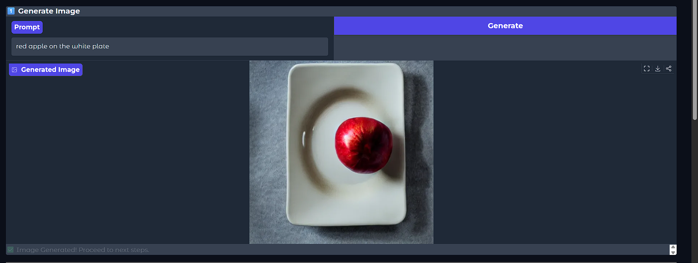
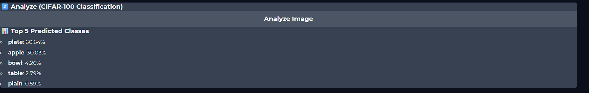
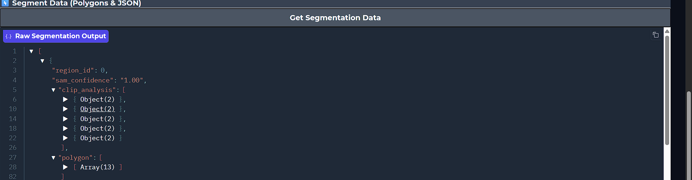
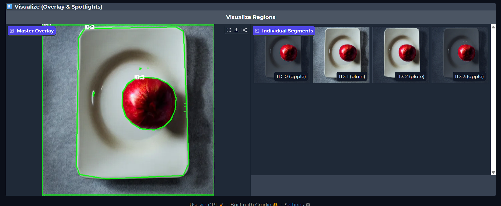

#  AI Multi-Model Generation & Analysis Pipeline

**A high-performance AI backend that integrates Text-to-Image Generation (Stable Diffusion), Semantic Analysis (CLIP), and Real-time Segmentation (SAM2) into a unified API.**

---

##  Key Features

* **Multi-Model Pipeline:** Chains **Stable Diffusion**, **CLIP**, and **SAM2** for seamless generation and analysis.
* **Performance Optimization:** Implements **smart global caching** to store segmentation results (`last_segmented_regions`). Re-running visualization or probing is near-instant (0.01s) as it reuses computed math from memory.
* **Advanced Visualization:** Generates overlay maps and "spotlight" images (dimmed background, bright object) for every segmented region.
* **Concept Probing:** Checks if specific concepts (e.g., "red", "furry") exist in the *whole image* OR specific *segmented regions* using Cosine Similarity.
* **Robust Logging & Error Handling:** Integrated `logging` tracks requests in real-time, while graceful exception management ensures structured JSON errors and detailed stack traces instead of silent crashes.
* **Dockerized:** Fully containerized for easy deployment on GPU or CPU environments.

---

##  System Architecture

1.  **Generation:** `Stable Diffusion` creates an image from text.
2.  **Analysis:** `CLIP` classifies the image (CIFAR-100) and encodes text/image features.
3.  **Segmentation:** `SAM2` (Segment Anything Model 2) detects objects and creates polygon masks.
4.  **Processing:**
    * **Caching:** Segmentation heavy lifting is done *once*. Subsequent calls for visualization read from RAM.
    * **Cropping:** Each segment is physically cropped and analyzed individually.

---

##  Model Configurations

| Task | Model Used | 
| :--- | :--- | 
| **Text-to-Image** | `CompVis/stable-diffusion-v1-4` | 
| **Image Analysis** | `ViT-B/32` | 
| **Segmentation** | `sam2.1_b.pt` |

---

##  Installation & Setup

### Option A: Docker (Recommended)

This project includes a `Dockerfile` for consistent deployment.

**1. Build the Image**
```bash
docker build -t ai-pipeline .

```

**2. Run the Container**

* **For GPU (Requires NVIDIA Container Toolkit):**
```bash
docker run --gpus all -p 8000:8000 ai-pipeline

```


* **For CPU Only:**
```bash
docker run -p 8000:8000 ai-pipeline

```


### Option B: Local Setup (Manual)

**Prerequisites:** Python 3.9+, CUDA 11.8+ (for GPU).

1. **Clone & Install Dependencies**
```bash
git clone https://github.com/karanpate1/Multi-Model-Generation-and-Analysis-Pipeline.git
cd Multi-Model-Generation-and-Analysis-Pipeline
pip install -r requirements.txt

```


2. **Environment Setup**
* **GPU Users:** Ensure `torch` is installed with CUDA support:
```bash
pip install torch torchvision --index-url [https://download.pytorch.org/whl/cu130](https://download.pytorch.org/whl/cu130)

```


* **CPU Users:** Standard install works, but generation will be slower.


3. **Run the Server**
```bash
uvicorn app.main:app --reload --host 0.0.0.0 --port 8000

```


---

##  API Documentation

### 1. Generate Image

**POST** `/generate`

* **Input:** `{  "prompt": "red apple in white plate"}`
* **Behavior:** Generates image.
* **Response:**
```json
{
  "request_id": "e9c80f74-186f-4e82-be32-2156a0f3c9a9",
  "generated_image": "iVBORw0KGgoA....",
   "clip_analysis": [
    {
      "class": "plate",
      "confidence": "60.64%"
    },....
  ]
}

```


### 2. Analyze Image

**POST** `/analyze`

* **Input:** None (Uses last generated image).
* **Behavior:** Performs a global classification of the current image using CLIP against the CIFAR-100 dataset classes.
* **Response:**

```json
{
  "request_id": "a0599c61-9362-4e75-b29f-e3838ac7b63a",
  "clip_scores": [
    {
      "class": "plate",
      "confidence": "60.64%"
    },
    {
      "class": "apple",
      "confidence": "30.03%"
    },.....    
  ],
  "segmentation": {
    "masks": [
      "region_0",....
    ],
    "polygons": [
      [
        [
          [
            0,
            2
          ],
          [
            0,
            221
          ], ...
      ],...
    ]
  }
}

```


### 3. Concept Probing

**POST** `/probe`

* **Input:** `{"prompt": "metal"}`
* **Behavior:** Calculates Cosine Similarity between the prompt and (1) the global image, (2) every specific segmented region.
* **Response:**

```json
{
  "probe_text": "orange",
  "global_match_score": "0.00%",
  "regional_matches": [
    {
      "region_id": 0,
      "class_label": "apple",
      "similarity_to_prompt": "15.65%"
    },
    ...
  ]
}

```


### 4. Get Segmentation Data

**POST** `/segment`

* **Input:** None (Uses last generated image).
* **Behavior:** Runs SAM2 to detect all objects and returns raw segmentation data (polygons, masks) without generating visualization images.
* **Response:**

```json
{  "request_id": "0ce9d657-5bd5-4e33-8867-cbf97a131f63",
    "segmented_regions": [
    {
      "region_id": 0,
      "sam_confidence": "0.99",
      "clip_analysis": [
        {
          "class": "plate",
          "confidence": "68.55%"
        }, ...
      ],
      "polygon": [
        [
          [
            184,
            52
          ],
          [
            103,
            77
          ],...
          ]
        ]
    }...]
},

```


### 5. Visualize Segmentation (Cached)

**POST** `/visualize`

* **Input:** None (Uses last generated image).
* **Behavior:** Returns a master overlay image + individual "spotlight" images for every object detected.
* **Response:**

```json
{
  "status": "success",
  "total_regions": 5,
  "master_overlay": "iVBORw..."
   "individual_spotlights": [
    {
      "region_id": 0,
      "top_class": "plate",
      "polygon": [
        [
          [
            0,
            2
          ],
          [
            0,
            221],...]]
    }...
}

```



## 🖥️ UI Dashboard (Gradio)

made a specialized UI to interact with the pipeline.

1. **Start the Backend:** `uvicorn app.main:app --reload`
2. **Start the UI:** `python ui.py`
3. **Access:** Open `http://127.0.0.1:7860` in your browser.


## 🔍 Logging & Error Handling

The application uses Python's standard `logging` library for production-grade monitoring.

* **Log File:** All events are saved to `app.log`.
* **Error Responses:** API returns structured JSON errors (HTTP 500/400) with detailed messages for debugging.

```log
2026-01-18 13:22:29,553 [INFO]  Generating image for request 7a2b9e14-9c3d-4f8a-b126-5e0d8f3c9a12
2026-01-18 14:33:42,448 [INFO]  Computing Segmentation for Visualization... for request 0ce9d657-5bd5-4e33-8867-cbf97a131f63


```
